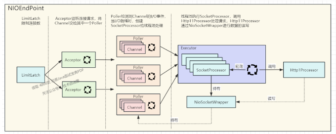

## 阿里2面：你们部署多少节点？1000W并发，当如何部署？

FSAC未来超级架构师
架构师总动员
实现架构转型，再无中年危机

### 说在前面

在40岁老架构师 尼恩的读者交流群(50+)中，
最近有小伙伴拿到了一线互联网企业如阿里、网易、有赞、希音、百度、网易、滴滴的面试资格，
遇到一几个很重要的面试题：

- 1000W并发，需部署多少个节点？
- 如何觉得部署多少个节点，是怎么预估以及部署的?

尼恩提示，部署架构、节点规划 相关的问题，是架构的核心知识，又是线上的重点难题。

- 部署架构
- 节点规划

所以，这里尼恩给大家做一下系统化、体系化的线程池梳理，
使得大家可以充分展示一下大家雄厚的 “技术肌肉”，让面试官爱到 “不能自已、口水直流”。

也一并把这个题目以及参考答案，
收入咱们的 《尼恩Java面试宝典 PDF》V102版本，
供后面的小伙伴参考，提升大家的 3高 架构、设计、开发水平。

- 3高架构、设计、开发水平

大家先思考一个问题，这也是在面试过程中经常遇到的问题。

- 如果你们公司现产品是卖口罩的，平时能够支持10W用户访问
- 遇到突发的情况，如疫情来了
- 预计在 1 个月后用户量会达到 1000W，如果这个任务交给你，你应该怎么做？

### 本文目录

- 说在前面
- 如何分析1000W用户并发的问题
    - 服务等级协议
- 1、并发中相关概念的解释
- 2、按照***二八法则***来推算 1000w 用户的访问量
- 3、服务器压力预估
    - 3.1 Tomcat 影响因素1：当前服务器系统资源
    - 3.2 Tomcat 影响因素2：Tomcat 依赖的 JVM 的配置
        - 1.3.2.1 堆空间说明
        - 1.3.2.2 程序计数器
        - 1.3.2.3 方法区
    - 3.3 Tomcat 影响因素3：Tomcat 本身的配置
    - 3.4 Tomcat 影响因素4：应用带来的压力
- 4、服务器数量评估
- 5、如何降低RT的值？
    - 5.1 数据库的优化
    - 5.2 磁盘数据访问优化
    - 5.3 合理利用内存
    - 5.4 调用远程服务
    - 5.5 异步化架构
- 6、应用服务的拆分
    - 6.1 如何拆分服务
    - 6.2 微服务化之后，如何进行服务治理？
    - 6.3 整体架构图
- 7、3高到底如何量化，如何度量？
    - 7.1 高并发中的宏观指标
    - 7.2 微观指标
    - 7.3 实践方案
        - 7.3.1 高性能实践方案
        - 7.3.2 高可用实践方案
        - 7.3.3 高扩展的实践方案
- 说在最后
- 参考文献
- 部分历史案例

### 如何分析1000W用户并发的问题

对于如何***支持 1000 万用户的问题***，实际上是一个相当抽象的问题。<br>
对于技术开发者来说，需要量化。<br>
什么是量化？就是需要一个***明确的性能指标数据***，以便在***执行关键业务时进行参考***。<br>

- 量化：明确的性能指标数据 & 执行关键业务时进行参考

例如，在高峰时段，系统的事务响应时间、并发用户数量、每秒查询率（QPS）、成功率等。

- 系统的事务响应时间
- 并发用户数量
- 每秒查询率（QPS）
- 成功率

量化的基本要求，就是各项指标，必须清晰明了。
只有这样，才能有效地指导整个架构的改进和优化。

- 量化的基本要求，就是各项指标，必须清晰明了
- 只有这样，才能有效地指导整个架构的改进和优化

因此，如果你面临这样的问题，首先需要找到问题的核心，也就是了解一些可以量化的数据指标。

- 如果你有相关的***历史业务交易数据***，那么你应该尽可能地参考这些数据，并处理这些收集来的原始数据（日志），
  以分析出高峰时段和该时段的***交易行为、规模***等信息，以便更清楚地了解需求细节。
- 如果你没有相关的数据指标可以参考，那么你就需要依靠经验来进行分析。
  例如，你可以参考一些类似行业的成熟业务交易模型（如银行业的日常交易活动或交通行业的售检票交易活动），
  或者直接采用“2/8”原则和“2/5/8”原则来开始实践。
- 当用户能在 2 秒内得到系统的响应时，他们会觉得系统响应迅速；
- 在 2-5 秒内得到响应时，他们会觉得系统响应速度尚可；
- 在 5-8 秒内得到响应时，他们会觉得系统响应速度较慢，但仍能接受；

然而，当用户在超过 8 秒后仍未得到响应时，他们会感到系统性能极差，
或者认为系统已经无法响应，从而选择离开网站，或者发起第二次请求。

在估算关键指标如响应时间、并发用户数量、每秒查询率（QPS）、成功率的同时，你也需要关注具体的业务功能需求。

每个业务功能都有其独特的特点。例如：

- 在某些场景下，可以不需要同步返回明确的执行结果；
- 而在某些业务场景下，可以接受返回“系统忙，请等待！”这样的提示信息，以避免过大的处理流量导致系统大规模瘫痪。

因此，学会平衡这些指标之间的关系是必要的。

- 在某些场景下，可以不需要同步返回明确的执行结果
- 而在某些业务场景下，可以接受返回“系统忙，请等待！“这样的提示信息，以避免过大的处理流量导致系统大规模瘫痪
- 学会平衡这些指标之间的关系是必要的

### 服务等级协议

在大多数情况下，最好为这些指标设定一个优先级顺序，并尽可能只关注几个高优先级的指标要求。
SLA：Service-Level Agreement 的缩写，意思是服务等级协议。
服务的 SLA 是服务提供者对服务消费者的正式承诺，是衡量服务能力等级的关键项。
服务 SLA 中定义的项必须是可测量的，有明确的测量方法。

- SLA：Service-Level Agreement 服务等级协议
- 服务的SLA是服务提供者对服务消费者的正式承诺，是衡量服务能力等级的关键项
- 服务SLA钟定义的项必须是可测量的，有明确的测量方法

| SLA项       | 含义                                                                                                                                                                                                                                      | 测量方法                     | 示例      | 服务级别 | 接口级别 |
|------------|-----------------------------------------------------------------------------------------------------------------------------------------------------------------------------------------------------------------------------------------|--------------------------|---------|------|------|
| 请求成功率      | 	测量周期内服务成功应答的请求占总请求数的百分比                                                                                                                                                                                                                | (成功应答请求数/总请求)*100        | >99%    | 是    | 	否   |
| 可用性        | 测量周期内，服务可用时间所占百分比，可用性分三个等级。1.99.999%-99.9999%，这个是可用性最高的服务，一年累计不可用时间为5.256分钟-31.536秒，这类服务不可用会影响到用户使用，比如登录2.99.99%%-99.999%，一年累计不可用时间为52.56分钟-5.256分钟，出现不可用时会影响用户的操作，间接面向用户的服务3. 99.9%-99.99%，一年累计不可用时间为8.76小时-52.56分钟，出现服务不可用时不会影响用户的使用。 | (服务在线时间/统计周期总时间)*100     | Level 1 | 是    | 否    |
| 数据一致性      | 服务消费者调用服务接口写入数据后马上调用服务接口读取，是否可以读到写入的数据内容，包含三个等级 1.强一致 2.弱一致 3.最终一致                                                                                                                                                                      | 调用资源创建接口，调用资源查询接口获取创建的数据 | 最终一致    | 是    | 否    |
| 吞吐量        | 每秒钟处理的请求数，对于服务集群建议给出总体吞吐量的计算方式，比如集群吞吐量=吞吐量*服务实例数，如果难以给出，则至少要给出典型的集群实例数情况总体吞吐量                                                                                                                                                           | 统计服务每秒处理的请求数量            | 200     | 是    | 可选   |
| TP50请求延迟   | 服务运行周期内50%的请求延时定义的值                                                                                                                                                                                                                     | 使用百分位计算方式                | 100ms   | 是    | 可选   |
| TP99.9请求延迟 | 服务运行周期内99.9%的请求延迟定义的值                                                                                                                                                                                                                   | 使用百分位计算方式	               | 200ms   | 是    | 可选   |

### 1、并发中相关概念的解释
在深入探讨上述问题之前，我想先向大家介绍一下与系统相关的一些关键评估指标:
- qps
- tps
- dau
- pv
- uv

这些关键概念，尼恩写过专门的文章介绍过， 具体请参见下面的文章：
> 你们系统qps多少，怎么部署的？假设每天有几千万请求，该如何部署？

### 2、按照二八法则来推算 1000w 用户的访问量
让我们回归最初的问题：1000W并发，需部署多少个节点？<br>
假设我们没有历史数据可以参考，我们可以采用二八定律来进行估算。<br>

- 假设有 1000W 用户，每天访问网站的用户占比为 20%，那么每天大约有 200W 用户访问。
- 假设每个用户平均点击 50 次，那么总的页面浏览量 PV[page view]=1 亿。
- 一天有 24 小时，根据二八定律，每天大部分用户活跃的时间点集中在(24 * 0.2) 约等于 5 个小时以内，
而大部分用户指的是（1 亿点击 * 80%）约等于 8000W（PV）， 意味着在 5 个小时以内，大概会有 8000W 点击进来，也就是每秒大约有 4500(8000W/5 小时)个请求。
- 4500 只是一个平均数值。在这 5 小时内，请求量并不一定均匀，可能会出现大量用户集中访问的情况（比如像淘宝这样的网站，日访问量高峰时间段集中在下午 14:00 和晚上 21:00，其中 21:00 是一天中访问量的最高峰）。
通常情况下，访问量高峰时段的请求量是平均请求量的 3 到 4 倍（这是一个经验值），我们按照 4 倍来计算。
那么在这 5 小时内，可能会出现每秒 18000 个请求的情况。
因此，问题由原本的支撑 1000W 用户，变成了一个具体的问题，就是服务器端需要能够支撑每秒 18000 个请求（QPS=18000）


### 3、服务器压力预估
在大致估算了***后端服务器需要承受的最高并发峰值***之后，
我们需要从***整个系统架构的角度进行压力测试，然后合理配置服务器数量和架构***。

首先，我们需要了解一台服务器能承受多大的并发量，那么该如何进行分析呢？<br>
由于我们的应用部署在 Tomcat 上，因此我们需要从 Tomcat 的性能入手。<br>

以下是一个描述 Tomcat 工作原理的图表，图表说明如下：
- LimitLatch 是连接控制器，它负责控制 Tomcat 能同时处理的最大连接数。
在 NIO/NIO2 模式下，默认值为 10000；而在 APR/native 模式下，默认值为 8192。
- Acceptor 是一个独立线程，它在 run 方法中的 while 循环里调用 socket.accept 方法接收客户端的连接请求。
每当有新的请求到来时，accept 会返回一个 Channel 对象，然后将该 Channel 对象交给 Poller[轮询者；轮询器] 处理。
Poller 本质上是一个 Selector，它也实现了线程。
Poller 在内部维护一个 Channel 数组，并在一个死循环中不断检测 Channel 的数据就绪状态。
一旦有 Channel 可读，它将生成一个 SocketProcessor 任务对象并交给 Executor 处理。
- SocketProcessor 实现了 Runnable 接口。当线程池执行 SocketProcessor 任务时，
它会通过 Http11Processor 处理当前请求。Http11Processor 读取 Channel 的数据以生成 ServletRequest 对象。
- Executor 是线程池，负责运行 SocketProcessor 任务。
SocketProcessor 的 run 方法会调用 Http11Processor 读取和解析请求数据。
我们知道，Http11Processor 是应用层协议的封装，它会调用容器获取响应，然后将响应通过 Channel 写出。



从这个图中我们可以得知，影响 Tomcat 请求数量的因素主要有四个方面。

NIOEndPoint
- LimitLatch 限制连接数
- Acceptor监听连接请求，将Channel交给其中一个Poller
- Poller检测到Channel的I/O事件，当I/O就绪时，创建SocketProcessor给线程池处理
- 线程池执行SocketProcessor，调用Http11Processor处理请求，Http11Processor通过NioSocketWrapper进行数据的读写。

从这个图中我们可以得知，影响 Tomcat 请求数量的因素主要有四个方面。

#### 3.1 Tomcat 影响因素1：当前服务器系统资源
我想可能大家遇到过类似“Socket/File：Can't open so many files”的异常，
这就是 ***Linux 系统中文件句柄***限制的表示。

在 Linux 操作系统中，每一个 TCP 连接都会占用一个文件描述符（fd），
当文件描述符超过 Linux 系统当前的限制时，就会弹出这个错误提示。

- Linux操作系统中，每个TCP连接都会占用一个文件描述符（fd）
- 当文件描述符超过Linux系统当前的限制时，就会弹出这个错误提示。
- Socket/File:Can't open so many files.

我们可以通过以下命令来查看一个进程能够打开的文件数量上限。
```
ulimit -a 或者 ulimit -n
```
open files （-n） 1024 是 linux 操作系统对一个进程打开的文件句柄数量的限制（也包含打开的套接字数量）
这里只是对用户级别的限制，其实还有个是对系统的总限制，查看系统总限制：
```
cat /proc/sys/fs/file-max
```

file-max 是设定系统所有进程总共可以打开的文件数量。

同时，部分程序可以通过setrlimit调用，设置每个进程的限制。
***如果收到大量文件句柄使用完毕的错误信息，那么我们应该考虑增加这个数值***。

当遇到上述错误时，我们可以通过以下方式进行修改（针对单个进程的文件打开数量限制）
```
vi /etc/security/limits.conf
root soft nofile 65535
root hard nofile 65535
* soft nofile 65535
* hard nofile 65535
```
- *代表所有用户、root表示 root 用户。
- noproc 表示最大进程数量
- nofile 代表最大文件打开数量。
- soft/hard，前者当达到阈值时，制作警告，后者会报错。

另外，还需要确保针对进程级别的文件打开数量限制是小于或等于系统的总限制，
如果不是，那么我们需要修改系统的总限制。

```
vi /proc/sys/fs/file-max
```

TCP 连接对于系统资源最大的开销在于内存。<br>
由于 TCP 连接需要双方进行数据接收和发送，因此需要设置读取缓冲区和写入缓冲区。<br>

在 Linux 系统中，这两个缓冲区的最小大小为 4096 字节，
可以通过查看/proc/sys/net/ipv4/tcp_rmem 和/proc/sys/net/ipv4/tcp_wmem 来获取相关信息。
- /proc/sys/net/ipv4/tcp_rmem
- /proc/sys/net/ipv4/tcp_wmem

因此，一个 tcp 连接最小占用内存为 4096+4096 = 8k，
那么对于一个 8G 内存的机器，如果不考虑其他限制，
其最大并发数约为：8 * 1024 * 1024/8 约等于 100 万。

这个数字是理论上的最大值，在实际应用中，
受到 Linux 内核对部分资源的限制以及程序业务处理的影响，
8GB 内存很难达到 100 万连接。

当然，我们可以通过增加内存来提高并发数。

#### 3.2 Tomcat 影响因素2：Tomcat 依赖的 JVM 的配置
我们都知道，Tomcat 是一个 Java 程序，运行在 JVM 上，
因此，对 JVM 进行优化也是提高 Tomcat 性能的关键。
下面简单介绍一下 JVM 的基本情况，如下图所示。


在 JVM 里，内存被划分为堆、程序计数器、本地方法栈、方法区（元空间）和虚拟机栈。
- 堆
- 程序计数器
- 本地方法栈
- 方法区（元空间）
- 虚拟机栈

##### 1.3.2.1 堆空间说明
堆内存是 JVM 内存中最大的一个区域，绝大多数的对象和数组都会被分配在此，它供所有线程共享。
堆空间被划分为新生代和老年代，新生代进一步被划分为 Eden 和 Survivor 区，如下图所示。


新生代和老年代的比例为 1:2，也就是说新生代占堆空间的 1/3，而老年代占 2/3。
另外，在新生代中，空间分配比例为 Eden:Survivor0:Survivor1=8:1:1。
举例来说，如果 Eden 区的内存大小是 40M，那么两个 Survivor 区的内存分别占 5M，
新生代的总内存就是 50M，进而计算出老年代的内存大小为 100M，也就是说堆空间的总内存大小是 150M。

可以通过 java -XX:PrintFlagsFinal -version 查看默认参数
```
uintx InitialSurvivorRatio                      = 8
uintx NewRatio                                  = 2
```

InitialSurvivorRatio: 新生代 Eden/Survivor 空间的初始比例
NewRatio ： Old 区/Young 区的内存比例

堆内存的具体工作机制如下：
- 绝大多数对象在创建后会被放置在 Eden 区，当 Eden 区满时，会触发 YGC（Young GC），大部分对象会被回收，仍有存活的对象会被复制到 Survivor0，此时 Eden 区被清空。
- 如果再次触发 YGC，存活的对象会从 Eden+Survivor0 区复制到 Survivor1 区，此时 Eden 和 Survivor0 区被清空。
- 再次触发 YGC，Eden+Survivor1 中的对象会被复制到 Survivor0 区，如此循环，直到对象的年龄达到阈值，则会被移至老年代。（这样的设计是因为 Eden 区的大多数对象会被回收）。
- Survivor 区无法容纳的对象会直接进入老年代。
- 当老年代满时，会触发 Full GC。

> GC 标记-清除算法 在执行过程中暂停其他线程？StopWorld


##### 1.3.2.2 程序计数器
程序计数器用于记录各个线程执行的字节码地址等信息，
在线程发生上下文切换时，依赖它来记录当前执行位置，
以便在下次恢复执行时能够从上次执行位置继续执行。

##### 1.3.2.3 方法区
方法区是一个逻辑概念，在 HotSpot 虚拟机的 1.8 版本中，它的具体实现就是元空间。

方法区主要用来存储已经被虚拟机加载的类相关信息，
包括类元信息、运行时常量池、字符串常量池，类信息又包括类的版本、字段、方法、接口和父类信息等。
- 元空间
    - 类元信息
      - 类的版本
      - 字段
      - 方法
      - 父类信息
    - 运行时常量池
    - 字符串常量池
    
方法区和堆空间相似，它是一个共享内存区域，因此方法区是线程共享的。

***本地方法栈和虚拟机栈***
Java 虚拟机栈是线程私有的内存空间，当创建一个线程时，会在虚拟机中分配一个线程栈，用于存储方法的局部变量、操作数栈、动态链接方法等信息。
每次调用一个方法，都会伴随着栈帧的入栈操作，当方法返回后，就是栈帧的出栈操作。
本地方法栈与虚拟机栈类似，本地方法栈用于管理本地方法的调用，也就是 native 方法。

***JVM 内存设置方法***
在了解上述基本知识后，我们来探讨一下 JVM 内存应该如何设置，以及有哪些参数可以用来设置。
在 JVM 中，需要配置的核心参数包括：
- -Xms，Java 堆内存大小
- -Xmx，Java 最大堆内存大小
- -Xmn，Java 堆内存中的新生代大小，扣除新生代剩下的就是老年代内存
新生代内存设置过小会频繁触发 Minor GC，频繁触发 GC 会影响系统的稳定性

- -XX:MetaspaceSize，元空间大小， 128M
- -XX:MaxMetaspaceSize，最大元空间大小 （如果没有指定这两个参数，元空间会在运行时根据需要动态调整。） 256M

一个新系统的元空间，基本上没办法有一个测算的方法，一般设置几百兆就够用，因为这里面主要存放一些类信息。

- -Xss，线程栈内存大小，这个基本上不需要预估，设置 512KB 到 1M 就行，因为值越小，能够分配的线程数越多。

JVM 内存的大小受到服务器配置的影响，
例如，一台拥有 2 个核心和 4G 内存的服务器，分配给 JVM 进程的内存大约为 2G。

这是因为服务器本身也需要内存，并且还需要为其他进程预留内存。
这 2G 内存还需要分配给栈内存、堆内存和元空间，因此，堆内存可用的大约为 1G。

然后，堆内存还需要划分为新生代和老年代。

#### 3.3 Tomcat 影响因素3：Tomcat 本身的配置
tomcat核心配置如下：
[Apache Tomcat 8 Configuration Reference (8.0.53) - The HTTP Connector] http://tomcat.apache.org/tomcat-8.0-doc/config/http.html
The maximum number of request processing threads to be created by this Connector, 
which therefore determines the maximum number of simultaneous requests that can be handled. 
If not specified, this attribute is set to 200. If an executor is associated with this connector, 
this attribute is ignored as the connector will execute tasks using the executor rather than an internal thread pool. 
Note that if an executor is configured any value set for this attribute will be recorded correctly 
but it will be reported (e.g. via JMX) as -1 to make clear that it is not used.

```properties
server:
  tomcat:
    uri-encoding: UTF-8
    # 最大工作线程数，默认200, 4核8g内存，线程数经验值800 [专业]
    # 操作系统做线程之间的切换调度是有系统开销的，所以不是越多越好。
    max-threads: 1000
    # 等待队列长度，默认100，
    accept-count: 1000
    max-connections: 20000
    # 最小工作空闲线程数，默认10, 适当增大一些，以便应对突然增长的访问量
    min-spare-threads: 100
```

***最大工作线程数，默认200, 4核8g内存，线程数经验值800***

- accept-count：这是最大等待数，当 HTTP 请求数量达到 Tomcat 的最大线程数时，
如果有新的 HTTP 请求到达，Tomcat 会将该请求放入等待队列中。
这个 acceptCount 就是指能够接受的最大等待数，默认值为 100。
如果等待队列也被填满，那么新的请求将会被 Tomcat 拒绝（connection refused）。

- maxThreads：这是最大线程数，每当一个 HTTP 请求到达 Web 服务时，Tomcat 都会创建一个线程来处理该请求。
maxThreads 决定了 Web 服务容器能同时处理多少个请求。maxThreads 默认值为 200，建议增加。
然而，增加线程会有成本，更多的线程不仅会带来更多的线程上下文切换成本，还会消耗更多的内存。
JVM 默认在创建新线程时会分配大小为 1M 的线程栈，因此，更多的线程意味着需要更多的内存。
线程数的经验值为：1 核 2g 内存为 200，线程数经验值 200；4 核 8g 内存，线程数经验值 800。

- maxConnections：这是最大连接数，这个参数指定了在同一时间内，Tomcat 能够接受的最大连接数。
对于 Java 的阻塞式 BIO，默认值是 maxthreads 的值；如果在 BIO 模式下使用自定义的 Executor 执行器，默认值将是执行器中 maxthreads 的值。
对于 Java 新的 NIO 模式，maxConnections 默认值是 10000。
对于 Windows 上的 APR/native IO 模式，maxConnections 默认值为 8192。

如果设置为-1，则禁用 maxconnections 功能，表示不限制 tomcat 容器的连接数。
maxConnections 和 accept-count 的关系为：当连接数达到最大值 maxConnections 后，系统会继续接收连接，但不会超过 acceptCount 的值。

#### 3.4 Tomcat 影响因素4：应用带来的压力
在我们之前的分析中，我们了解到当 NIOEndPoint 接收到客户端的请求连接后，
会生成一个 SocketProcessor 任务并将其提交给线程池处理。

- 当NIOEndPoint接收到客户端的请求连接后->会生成一个SocketProcessor任务并将其提交给线程池处理

SocketProcessor 中的 run 方法会调用 HttpProcessor 组件来解析应用层的协议，并生成 Request 对象。

最后，调用 Adapter 的 Service 方法将请求传递到容器中。
容器主要负责处理内部的请求，即当前置的连接器通过 Socket 获取到信息后，
将获得一个 Servlet 请求，而容器则负责处理这个 Servlet 请求。

Tomcat 使用 Mapper 组件将用户请求的 URL 定位到一个具体的 Servlet，
然后 Spring 中的 DispatcherServlet 拦截到该 Servlet 请求后，
基于 Spring 自身的 Mapper 映射定位到我们具体的 Controller 中。

- Tomcat使用Mapper组件将用户请求的URL定位到一个具体的Servlet
- 然后Spring中的DispatcherServlet拦截到该Servlet请求后
- 基于Spring自身的Mapper映射定位到我们具体的Controller中

当请求到达 Controller 后，对于我们的业务来说，才算是请求的真正开始。<br>
Controller 调用 Service、Service 调用 dao，完成数据库操作后将请求原路返回给客户端，完成一次整体的会话。<br>
因此，Controller 中的业务逻辑处理时间，会对整个容器的并发性能产生影响。


### 4、服务器数量评估
简单的数学计算一下：
假设一个 Tomcat 节点的 QPS 为 500，如果要支持高峰时期的 QPS 为 18000，那么需要 40 台服务器。
- Tomcat节点的QPS为500
- 高峰时期的QPS为18000
- 需要40台服务器

这 40 台服务器需要通过 Nginx 软件负载均衡进行请求分发。
***Nginx的性能很好，官方说明其处理静态文件的并发能力可达*** 5W/s。

由于 Nginx 不能单点，我们可以采用 LVS 对 Nginx 进行负载均衡，
LVS（Linux VirtualServer）采用 IP 负载均衡技术实现负载均衡。
- LVS对Nginx进行负载均衡
- LVS[Linux VirtualServer]采用IP负载均衡技术实现负载均衡


通过这样的一组架构，我们当前服务端是能够同时承接 QPS=18000，但还不够。我们回到之前提到的两个公式。
- QPS=并发量/平均响应时间
- 并发量=QPS * 平均响应时间

假设我们的 RT 为 3s，那么服务器端的并发数=18000 * 3=54000，
即同时有 54000 个连接打到服务器端。因此，服务端需要同时支持的连接数为 54000。

如果 RT 越大，意味着积压的连接越多，这些连接会占用内存资源/CPU 资源等，容易造成系统崩溃。

- RT越大，意味着积压的连接越多，这些连接会占用内存资源/CPU资源等，容易造成系统崩溃

同时，当连接数超过阈值时，后续的请求无法进入，用户会得到一个请求超时的结果，这不是我们希望看到的。
因此，我们必须缩短 RT 的值。

### 5、如何降低RT的值？
继续看上面这个图，一个请求需要等待 Tomcat 容器中的应用执行完成后才能返回。
在执行过程中，请求会进行哪些操作呢？
- 查询数据库
- 访问磁盘数据
- 进行内存运算
- 调用远程服务

这些操作都会消耗时间，客户端请求需要等待这些操作完成后才能返回。
因此，降低响应时间的方法就是优化业务逻辑处理。

#### 5.1 数据库的优化
当 18000 个请求进入服务端并被接收后，开始执行业务逻辑处理，必然会涉及到数据库查询。
每个请求至少执行一次数据库查询操作，多的需要查询 3~5 次以上。
假设按照 3 次计算，那么每秒会对数据库形成 54000 个请求。

假设一台数据库服务器每秒支持 10000 个请求（影响数据库请求数量的因素有很多，如数据库表的数据量、数据库服务器的系统性能、查询语句的复杂度），
那么需要 6 台数据库服务器才能支持每秒 10000 个请求。

除此之外，数据库层面还有其他优化方案。

- 首先是 MySQL 的最大连接数设置。当访问量过高时，可能会遇到 MySQL: ERROR 1040: Too many connections 的问题，原因就是连接数耗尽。
如果服务器的并发连接请求量较大，建议调高此值，以增加并行连接数量。
但需要考虑到机器的承载能力，因为连接数越多，每个连接提供的连接缓冲区会占用越多的内存，所以要适当调整该值，不能盲目提高设值。

- 引入缓存组件。数据表数据量过大，例如达到几千万甚至上亿。这种情况下，SQL 优化已经意义不大，因为这么大的数据量查询必然会涉及到计算。
可以通过缓存解决读请求并发过高的问题。 
一般来说，数据库的读写请求遵循二八法则。
在每秒 54000 个请求中，大约有 43200 个是读请求，这些读请求中大约 90% 都可以通过缓存解决。

将 MySQL 数据库中的数据放入 Redis 缓存中可以提升性能的原因如下：
- 1.Redis 存储的是 Key-Value 格式的数据，其查找时间复杂度为 O(1)（常数阶），
而 MySQL 引擎底层实现是 B+Tree，时间复杂度为 O(logn)（对数阶）。
因此，Redis 相较于 MySQL 具有更快的查询速度。
- 2.MySQL 数据存储在表中，查找数据时需要对表进行全局扫描或根据索引查找，这涉及到磁盘查找。
而 Redis 则无需这么复杂，因为它直接根据数据在内存中的位置进行查找。
- 3.Redis 是单线程的多路复用 IO，避免了线程切换的开销和 IO 等待的开销，从而在多核处理器下提高了处理器的使用效率。

> Redis是单线程的多路复用IO，避免了线程切换的开销和IO等待的开销
> 从而在多核处理器下提高了处理器的使用效率

- 分库分表，减少单表数据量，单表数据量少了，查询性能自然得到有效提升。
- 读写分离，避免事务操作对查询操作带来的性能影响。写操作本身耗费资源，数据库写操作为 IO 写入，写入过程中通常会涉及唯一性校验、建索引、索引排序等操作，对资源消耗较大。
一次写操作的响应时间往往是读操作的几倍甚至几十倍。锁争用，写操作很多时候需要加锁，包括表级锁、行级锁等。这类锁都是排他锁，一个会话占据排它锁后，
其他会话不能读取数据，这会极大影响数据读取性能。
因此，MySQL 部署通常采用读写分离方式，主库用来写入数据及部分时效性要求很高的读操作，从库用来承接大部分读操作，这样数据库整体性能能够得到大幅提升。
- sql+nosql异构存储。针对不同特性的数据采用不同的存储库，例如 MongoDB（NoSQL 文档化存储）、Redis（NoSQL Key-Value 存储）、HBase（NoSQL 列式存储），
这些数据库在某种程度上与 Key-Value 数据库相似。nosql具有很高的扩展性，适合管理大量非结构化数据。


- 客户端池化技术，减少频繁创建数据库连接的性能损耗。在每次进行数据库操作之前，先建立连接，然后进行数据库操作，最后释放连接。
这个过程涉及到网络通信的延时，以及频繁创建和销毁连接对象的性能开销。
当请求量较大时，这种性能损耗会变得非常明显。通过使用连接池技术，可以重用已创建的连接，降低这种性能损耗。

#### 5.2 磁盘数据访问优化
对于磁盘操作，主要包括读取和写入。
例如，在交易系统场景中，通常需要对账文件进行解析和写入。
针对磁盘操作的优化方法有：

- 利用磁盘缓存，通过缓存 I/O，充分利用系统缓存，以降低实际 I/O 的次数。
- 采用顺序读写，用追加写代替随机写，减少寻址开销，提高 I/O 写入速度。
- 使用 SSD 代替 HDD，固态硬盘的 I/O 效率远高于机械硬盘。
- 在频繁读写相同磁盘空间时，可以使用 mmap（内存映射）代替 read/write，减少内存拷贝次数。
- 在需要同步写入的场景中，尽量合并写请求，而不是让每个请求都同步写入磁盘，可以使用 fsync() 代替 O_SYNC。

#### 5.3 合理利用内存
充分利用内存缓存，将经常访问的数据和对象保存在内存中，以避免重复加载或减少数据库访问带来的性能损耗。

#### 5.4 调用远程服务
远程服务调用会影响到 I/O 性能，主要包括：
- 远程调用等待返回结果的阻塞
  - 异步通信
- 网络通信的耗时
  - 内网通信
  - 增加网络带宽
- 远程服务通信的稳定性

#### 5.5 异步化架构
在微服务中，针对***处理时间长***、***逻辑复杂***的情况，高并发时可能导致服务线程耗尽，无法创建新线程处理请求。<br>

针对这种情况，除了在程序层面优化（如数据库调优、算法调优、缓存等），还可以考虑在架构上进行调整，如先返回结果给客户端，
让用户可以继续使用客户端的其他操作，然后将服务端的复杂逻辑处理模块进行异步化处理。

- 数据库调优
- 算法调优
- 缓存

这种异步化处理方式适用于客户端对处理结果不敏感、不要求实时的场景，如群发邮件、群发消息等。

异步化设计的解决方案有：
- 多线程
- 消息队列（MQ）

### 6、应用服务的拆分
除了上述手段外，将业务系统拆分为微服务也十分必要，原因包括：
- 业务发展导致应用程序复杂度增加，产生熵增现象。
- 业务系统功能越来越多，参与开发迭代的人员也越来越多，维护一个庞大的项目容易出现问题。
- 单个应用系统难以实现横向扩容，服务器资源有限，可能导致所有请求集中请求到某个服务器节点，造成资源消耗过大，系统不稳定。
- ***测试、部署成本逐渐增加***。

最重要的是，单个应用在性能上的瓶颈难以突破。

例如，要支持 18000 QPS，单个服务节点肯定无法支撑。
因此，服务拆分的好处在于可以利用多台计算机组成一个大规模的分布式计算网络，通过网络通信完成整个业务逻辑。


#### 6.1 如何拆分服务
关于如何拆分服务，虽然看起来简单，但实际操作时会遇到一些边界问题。
例如，有些数据模型既适用于 A 模块，也适用于 B 模块，如何划分界限呢？此外，服务拆分的粒度应该如何确定呢？
通常，服务拆分是按照业务进行的，并根据领域驱动设计（DDD）来指导微服务的边界划分。
- 领域驱动设计（DDD）指导微服务的边界划分

领域驱动设计是一套方法论，通过定义领域模型，从而确定业务边界和应用边界，以保证业务模型和代码模型的一致性。
- 领域驱动设计是一套方法论
- 通过定义领域模型，从而确定业务边界和应用边界
- ***保证业务模型和代码模型的一致性***

无论是 DDD 还是微服务，都需要遵循软件设计的基本原则：***高内聚低耦合***。
服务内部应具有高内聚性，服务之间应具有低耦合性。
实际上，一个领域服务对应了一个功能集合，这些功能具有一定共性。
例如，订单服务包括创建订单、修改订单、查询订单列表等功能，领域边界越清晰，功能内聚性越强，服务之间的耦合性就越低。
服务拆分还需要根据当前技术团队和公司状况来进行。
对于初创团队，不应过分追求微服务，以免导致业务逻辑过于分散，技术架构过于复杂，再加上基础设施尚不完善，
可能导致交付时间延长，对公司发展产生较大影响。因此，在进行服务拆分时，还需要考虑以下因素：

- 公司业务所处领域的市场性质，如果是市场敏感项目，应先推出产品，然后再进行迭代和优化。
- 开发团队的成熟度，团队技术能否承接。
- 基础能力是否足够，如 DevOps、运维、测试自动化等基础能力。***团队是否有能力支持大量服务实例运行带来的运维复杂度，是否可以做好服务监控***。
- 测试团队的执行效率，如果测试团队不能支持自动化测试、自动回归、压力测试等手段来提高测试效率，那必然会导致测试工作量显著增加，从而导致项目上线周期延期。

对于旧系统改造，可能涉及的风险和问题更多。在开始改造之前，需要考虑以下几个步骤：拆分前准备阶段、设计拆分改造方案、实施拆分计划。

- 在开始分解之前，需要先对当前的整体架构以及各个模块之间的依赖关系有一个清晰的理解，同时，在准备阶段，主要需要弄明白依赖关系和接口。
这样可以在分解时知道如何操作，比如应该在哪里进行第一次切割，以便将一个复杂的单体系统迅速变为两个较小的系统，同时，也要尽量减少对系统现有业务的影响。要避免构建出一个分布式的单体应用，这种应用包含了许多互相之间紧密耦合的服务，却又必须一起部署，这被称为所谓的分布式系统。
如果没有进行深入的分析就强行分解，可能会不小心切断重要的依赖，导致出现 A 类大故障，后果不堪设想。
- 在不同的阶段，分解的重点是不同的，每个阶段都有其需要关注的核心问题。分解本身可以分为三个阶段：核心业务和非业务部分的分解、核心业务的调整设计、核心业务内部的分解。在第一个阶段，需要将核心业务精简，将非核心部分剥离，以减小需要处理的系统规模；在第二个阶段，需要按照微服务的设计理念重新构建核心业务部分；
在第三个阶段，需要将核心业务部分的重构设计实施。分解的方式也有三种：代码分解、部署分解、数据分解。
> 代码分解 & 部署分解 & 数据分解

另外，每个阶段需要集中精力在一到两个具体的目标上，如果目标过多，反而可能会一事无成。 
例如，某个系统的微服务分解，制定了如下几个目标：

- 1.性能指标（吞吐量和延迟）：核心交易的吞吐量提升一倍以上（TPS：1000->10000），
A 业务的延迟减少一半（Latency：250ms->125ms），B 业务的延迟减少一半（Latency：70ms->35ms）。
- 2.稳定性指标（可用性，故障恢复时间）：可用性>=99.99%，A 类故障恢复时间<=15 分钟，一个季度内的故障次数<=1 次。
- 3.质量指标：编写完整的产品需求文档、设计文档、部署运维文档，核心交易部分代码 90% 以上单测覆盖率和 100% 的自动化测试用例和场景覆盖，
实现可持续的性能测试基准环境和长期持续性能优化机制。
- 4.扩展性指标：完成代码、部署、运行时和数据多个维度的合理分解，对于核心系统重构后的各块业务和交易模块、以及对应的各个数据存储，都可以随时通过增加机器资源实现伸缩扩展。
- 5.可维护性指标：建立全面完善的监控指标、特别是全链路的实时性能指标数据，覆盖所有关键业务和状态，缩短监控报警响应处置时间，
配合运维团队实现容量规划和管理，出现问题时可以在一分钟内拉起系统或者回滚到上一个可用版本（启动时间<=1 分钟）。
- 6.易用性指标：通过重构实现新的 API 接口既合理又简单，极大地满足各个层面用户的使用需求，客户满意度持续上升。
- 7.业务支持指标：对于新的业务需求功能开发，在保障质量的前提下，开发效率提升一倍，开发资源和周期降低一半。

当然，不要期望一次性完成所有目标，每一个阶段可以选择一两个优先级高的目标进行执行。

> 性能指标（吞吐量和延迟） & 稳定性指标（可用性，故障恢复时间） & 质量指标 & 扩展性指标 & 可维护性指标 & 易用性指标 & 业务支持指标


#### 6.2 微服务化之后，如何进行服务治理？
微服务架构首先表现为一种分布式架构，其次，我们需要展现和提供业务服务能力，
接着，我们要考虑与这些业务能力相关的各种非功能性能力。
这些分散在不同位置的服务需要被统一管理，同时对服务的调用方保持透明，这样就产生了服务注册和发现的功能需求。

同样地，每个服务可能会部署在多台机器上的多个实例，因此，我们需要具备路由和寻址的能力，实现负载均衡，以提高系统的扩展性。
面对这么多对外提供的服务接口，我们需要一种机制来统一接入控制，并将一些非业务策略应用到这个接入层，例如权限相关的策略，这就是服务网关的作用。
同时，我们发现随着业务的发展和特定运营活动（如秒杀、大促等）的进行，
流量可能会激增十倍以上，这时候我们就需要考虑系统容量、服务间的强弱依赖关系，实施服务降级、熔断和系统过载保护等措施。

- 需要考虑系统容量、服务间的强弱依赖关系
- 实施服务降级、熔断和系统过载保护

以上由于微服务带来了这些复杂性，应用配置和业务配置都被分散到各个地方，因此，分布式配置中心的需求也随之产生。

最后，系统在分散部署后，所有的调用都涉及到跨进程，
我们还需要一套能够在线进行链路跟踪和性能监控的技术，
以便随时了解系统内部的状态和指标，使我们能够随时对系统进行分析和干预。


#### 6.3 整体架构图
通过从微观到宏观的全面分析，我们可以基本上构建出一个完整的架构图。
- 接入层，这是外部请求进入内部系统的门户，所有的请求都必须通过 API 网关。
- 应用层，也被称为聚合层，它为相关业务提供聚合接口，并调用中台服务进行组合。
- 原子服务，包括就是原子技术服务，原子业务服务，根据业务需求提供相关的接口。

原子服务为整个架构提供可复用的能力，
例如，评论服务作为一项原子服务，在B站的视频、文章、社区都需要，那么为了提高复用性，评论服务就可以独立为原子服务，不能与特定需求紧密耦合。
在这种情况下,  评论服务，需要供一种可以适应不同场景的复用能力。

类似的，文件存储、数据存储、推送服务、身份验证服务等功能，
都会沉淀为原子服务，业务开发人员，在原子服务基础上，进行编排、配置、组合，可以快速构建业务应用。
- 原子服务
- 业务开发人员，在原子服务基础上，进行编排、配置、组合，可以快速构建业务应用


### 7、3高到底如何量化，如何度量？
3高到底如何量化，如何度量？
高并发没有一个确切的定义，它主要描述的是在短时间内面临大量流量的情况。

当你在面试或者工作中，你的领导或者面试官询问你如何设计一个能承受千万级别流量的系统时，你可以按照我提供的步骤进行分析。
- 首先，你需要确立一些可以量化的数据指标，例如每秒查询率（QPS）、每日活跃用户数（DAU）、总用户数、每秒事务数（TPS）以及访问峰值。
- 然后，根据这些数据，你开始设计系统的架构方案。
- 接着落地执行

#### 7.1 高并发中的宏观指标
一个能满足高并发需求的系统，并不是单纯地追求性能，而是需要至少满足三个宏观目标：
- 高性能，这是系统并行处理能力的体现。在有限的硬件投入下，提高性能就意味着节约成本。
同时，性能也关乎用户体验，响应时间是 100 毫秒还是 1 秒，用户的感受是完全不同的。
- 高可用，这是系统能正常提供服务的时间。
一个全年无故障、不停机的系统，和一个经常出故障、宕机的系统，用户肯定会选择前者。
另外，如果系统的可用性只能达到 90%，也会对业务造成重大影响。
- 高扩展，这是系统的扩展能力，即在流量高峰期是否能在短时间内完成扩容，
以更稳定地承受峰值流量，例如双 11 活动、明星离婚等热点事件。


#### 7.2 微观指标
##### 性能指标
通过性能指标，我们可以衡量当前的性能问题，并作为优化性能的评估依据。通常，我们会把一段时间内的接口响应时间作为衡量标准。
- 1.平均响应时间：这是最常用的衡量方式，但它的缺点是对于慢请求不敏感。
例如，1 万次请求中，有 9900 次是 1 毫秒，有 100 次是 100 毫秒，那么平均响应时间就是 1.99 毫秒。
尽管平均耗时仅增加了 0.99 毫秒，但 1% 的请求的响应时间已经增加了 100 倍。
- 2.TP90、TP99 等分位值：这是将响应时间按照从小到大排序后的指标，
TP90 表示排在第 90 分位的响应时间，分位值越大，对慢请求越敏感。


##### 可用性指标
高可用性是指系统具有较高的无故障运行能力，可用性 = 平均故障时间 / 系统总运行时间，通常我们用几个 9 来描述系统的可用性。
对于高并发系统，最低要求是保证 3 个 9 或者 4 个 9。原因很直观，如果你只能做到 2 个 9，意味着有 1% 的故障时间，
对于一些大公司每年千亿级别的 GMV[ 商品交易总额（Gross Merchandise(ˈmɜːrtʃəndaɪs ) Volume，简称GMV）]或收入，1% 的故障时间将导致十亿级别的业务影响。

##### 可扩展性指标
在面对突发流量时，我们不能临时改造架构，所以增加机器以线性提高系统的处理能力是最快的方式。
对于业务集群或基础组件，扩展性 = 性能提升比例 / 机器增加比例，理想的扩展能力是：资源增加几倍，性能提升几倍。
通常来说，扩展能力要保持在 70% 以上。
然而，从高并发系统的整体架构角度看，扩展的目标不仅仅是把服务设计成无状态，
因为当流量增加 10 倍，业务服务可以快速扩容 10 倍，但数据库可能会成为新的瓶颈。

- 从高并发系统的整体架构角度看，扩展的目标不仅仅是把服务设计成无状态
- 因为当流量增加10倍，业务服务可以快速扩容10倍，但数据库可能会成为新的瓶颈

像 MySQL 这样的有状态存储服务通常是扩展的技术难点，如果架构上没有提前规划（垂直和水平拆分），就可能涉及到大量数据的迁移。
因此，高扩展性需要考虑：服务集群、数据库、缓存和消息队列等中间件、负载均衡、带宽、依赖的第三方等，当并发达到某一个量级后，上述每个因素都可能成为扩展的瓶颈点。
- 服务集群
- 数据库
- 缓存
- 消息队列等中间件
- 负载均衡
- 宽带
- 依赖的第三方

#### 7.3 实践方案
通用设计方法
##### 纵向扩展（scale-up）
它的目标是提升单机的处理能力，方案又包括：<br>
- 1.提升单机的硬件性能：通过增加内存、CPU 核数、存储容量、或将磁盘升级成 SSD 等方式来提升。
- 2.提升单机的软件性能：使用缓存减少 IO 次数，使用并发或异步的方式增加吞吐量。

##### 横向扩展（scale-out）
由于单机性能总有极限，所以最终还需要引入横向扩展，通过集群部署以进一步提高并发处理能力，包括以下两个方向：
- 1.做好分层架构：这是横向扩展的基础，因为高并发系统通常业务复杂，通过分层处理可以简化复杂问题，更容易做到横向扩展。
- 2.各层进行水平扩展：无状态水平扩容，有状态做分片路由。业务集群通常能设计成无状态的，而数据库和缓存往往是有状态的，
因此需要设计分区键做好存储分片，当然也可以通过主从同步、读写分离的方案提升读性能。

> 无状态水平扩容 & 有状态做分片路由<br>
> 业务集群通常能设计成无状态的，而数据库和缓存往往是有状态的

##### 7.3.1 高性能实践方案
- 1.分布式部署，通过负载均衡分担单机压力。
- 2.多层次缓存，包括静态数据使用 CDN、本地缓存、分布式缓存等，以及处理缓存场景中的热点 key、缓存穿透、缓存并发、数据一致性等问题。
- 3.数据库和索引优化，以及利用搜索引擎解决复杂查询问题。
- 4.考虑使用 NoSQL 数据库，如 HBase、TiDB 等，但团队需熟悉这些组件并具备强大的运维能力。
- 5.异步处理，将次要流程通过多线程、消息队列、甚至延时任务进行异步处理。
- 6.流量控制，考虑业务是否允许限流（如秒杀场景），包括前端限流、Nginx 接入层限流、服务端限流。
- 7.流量削峰填谷，通过消息队列接收流量。
- 8.并发处理，通过多线程将串行逻辑并行化。
- 9.预计算，如抢红包场景，***可提前计算红包金额并缓存***，发红包时直接使用。
- 10.缓存预热，通过异步任务提前将数据预热到本地缓存或分布式缓存中。
- 11.减少 IO 次数，如数据库和缓存的批量读写、RPC 的批量接口支持、或通过冗余数据减少 RPC 调用。
- 12.减少 IO 时的数据包大小，包括采用轻量级通信协议、合适的数据结构、去除接口中多余字段、减少缓存 key 大小、压缩缓存 value 等。
- 13.优化程序逻辑，如将高概率阻断执行流程的判断逻辑前置、For 循环计算逻辑优化，或采用更高效算法。
- 14.使用各种池化技术，如 HTTP 请求池、线程池（考虑 CPU 密集型或 IO 密集型设置核心参数）、数据库和 Redis 连接池等。
- 15.JVM 优化，包括新生代和老年代的大小、GC 算法选择等，以减少 GC 频率和耗时。
- 16.锁策略选择，读多写少场景使用乐观锁，或考虑通过分段锁减少锁冲突。

##### 7.3.2 高可用实践方案
- 1.节点故障转移，Nginx和服务治理框架支持故障节点切换到另一个节点。
- 2.非对等节点的故障转移，***通过心跳检测并实施主备切换（如 Redis 哨兵模式或集群模式、MySQL 主从切换等）***。
- 3.设置接口层的超时、重试策略和幂等设计。
- 4.降级处理，保证核心服务，牺牲非核心服务，必要时进行熔断；或核心链路出问题时，有备选链路。
- 5.流量控制，对超过系统处理能力的请求直接拒绝或返回错误码。
- 6.消息队列的可靠性保证，包括生产者端的重试机制、消息代理的持久化、消费者端的 ack 机制等。
- 7.灰度发布，支持按机器维度进行小流量部署，观察系统日志和业务指标，运行稳定后再推全量。
- 8.监控报警，包括基础 CPU、内存、磁盘、网络 监控，以及 Web 服务器、JVM、数据库、各类中间件监控和业务指标监控。
- 9.灾备演练，类似当前的“混沌工程”，对系统进行破坏性手段，观察局部故障是否会引起可用性问题。

高可用方案主要从冗余、取舍、系统运维三个方向考虑，同时需有配套的值班机制和故障处理流程，当出现线上问题时，可及时跟进处理。

##### 7.3.3 高扩展的实践方案
1、合理的分层架构，例如互联网最常见的分层架构，还可以进一步按照数据访问层、业务逻辑层对微服务进行更细粒度的分层（但需评估性能，会存在网络多一跳的情况）。
2、存储层拆分，按照***业务维度进行垂直拆分***、按照***数据特征维度进行水平拆分***（分库分表）。
3、业务层拆分，最常见的是按照业务维度拆（如电商场景的商品服务、订单服务等），也可以按照核心接口和非核心接口拆，还可以按照请求去拆（如 To C 和 To B，APP 和 H5）。

### 说在最后
高并发相关面试题，是非常常见的面试题。
以上的内容，如果大家能对答如流，如数家珍，基本上 面试官会被你 震惊到、吸引到。
最终，让面试官爱到 “不能自已、口水直流”。offer， 也就来了。
学习过程中，如果有啥问题，大家可以来 找 40岁老架构师尼恩交流。
