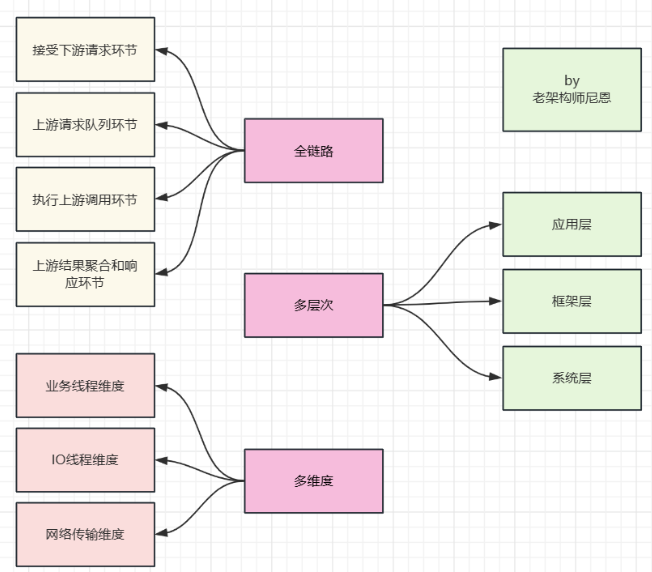

## 阿里面试：页面调10 个上游接口，如何做高并发？

[链接](https://mp.weixin.qq.com/s/eazMPWdVL5Ge1YaGeH5Dsw)

### 说在前面
在40岁老架构师 尼恩的读者交流群(50+)中，
最近有小伙伴拿到了一线互联网企业如阿里、滴滴、极兔、有赞、希音、百度、网易的面试资格，遇到很多很重要的面试题：

```
一个页面要调100 个上游接口，如何优化？
一个场景题，一个页面中，需要通过调用下游系统的很多很多个接口来获取数据，请问最优的高并发设计方?
```

就在昨天， 一个小伙伴面试阿里， 遇到这道题：
```
场景题：一次要调10 个上游接口，如何做高并发？
```

小伙伴 没有回答好，导致面试挂了，来求助尼恩，
如何才能回答得很漂亮， 让面试官刮目相看、口水直流。

尼恩提示：并发调用的知识，既是面试的核心知识，又是开发的核心知识。

所以，尼恩给大家做一下系统化、体系化的梳理，使得大家内力猛增，
可以充分展示一下大家雄厚的 “技术肌肉”，让面试官爱到 “不能自已、口水直流”，然后实现”offer直提”。

当然，这道面试题，以及参考答案，也会收入咱们的 《尼恩Java面试宝典》V114版本PDF集群，
供后面的小伙伴参考，提升大家的 3高 架构、设计、开发水平。

```
最新《尼恩 架构笔记》《尼恩高并发三部曲》《尼恩Java面试宝典》的PDF，
请关注本公众号【技术自由圈】获取，后台回复：领电子书
```

### 本文目录
- 说在前面
- 正确、最佳的答题姿势
- 全链路如何拆分后，进行优化和改造呢？
- 多层次如何拆分后，进行优化和改造呢？
- 多维度优化和改造，主要有哪些呢？
- ***业务线程***，***IO线程***，如何进行优化和改造呢？
- ***网络传输维度***，如何进行优化和改造呢？
- 方案一实操
  - 方案一性能基线测试
- 方案二实操
  - 方案二性能基线测试
- 方案三实操
  - 方案三性能基线测试
- 说在最后
- 部分历史案例

### 正确、最佳的答题姿势
尼恩给大家梳理一下正确、最佳的答题姿势。有了这个姿势，面试官自然爱到 “不能自已、口水直流”
页面调10 个上游接口，如何做高并发？
首先， 告诉面试官， 解决这个问题，需要  全链路、多层次、多维度进行 优化和改造。
- 全链路
- 多层次
- 多维度



#### 全链路如何拆分后，进行优化和改造呢？
庖丁解牛，但是也不需要太复杂，可以简单的把全链路拆分如下：
- 接受下游请求环节
- 上游请求分裂后入列环节
- 执行上游调用环节
- 上游结果聚合和响应环节


#### 多层次如何拆分后，进行优化和改造呢？
核心的措施是：***异步化***， 但是，要分层进行异步化
可以简单的，把用户的api调用解耦为三层, 如下图所示：
- 应用层：编程模型的异步化
- 框架层：IO线程的异步化
- OS层：IO模型的异步化

解耦之后，再庖丁解牛，一层一层的进行异步化架构。


- 命令式编程->应用层：编程模型的异步化->响应式编程，本质是：异步回调
- HTTPClient阻塞式请求处理->框架层：IO线程的异步化->Netty Reactor反应式
- BIO->OS层：IO模型的异步化->AIO io_uring环形IO

如何实现全链路异步，知识非常多，具体请参见尼恩的《全链路异步，让你的 SpringCloud 性能优化10倍+》、《NIO学习圣经》等深度文章。
建议大家把以上这些文章，作为作为一个体系来学习。

### 多维度优化和改造，主要有哪些呢？
其实有很多， 但是主要聚焦的点是：


- 多维度
- 业务线程维度
- IO线程维度
- 网络传输维度
- 其他维度

#### 业务线程，IO线程，如何进行优化和改造呢？
前面已经庖丁解牛，但是也不需要太复杂，可以把简单的把全链路拆分如下：
- 接受下游请求环节
- 上游请求分裂后入列环节
- 执行上游调用环节
- 上游结果聚合和响应环节

第二个环节涉及到了 业务线程池，第三个环节涉及到了 IO线程池
都需要合理的设置线程池的大小、拒绝策略。 
并且结合不同的框架和组件，结合自己的业务场景实现异步。

```
第二个环节涉及到了业务线程池
第三个环节涉及到了IO线程池
都需要合理的设置线程池的大小、拒绝策略
并且结合不同的框架和组件，结合自己的业务场景实现异步。
```

比如：
- 方案一：使用 CompletableFuture （自定义业务线程池）  + httpClient （池化同步io框架） + CountDownLatch闭锁（聚合结果）
- 方案二：CloseableHttpAsyncClient（池化异步io框架） + CountDownLatch闭锁（聚合结果）
- 方案三：自研Netty 异步IO框架+ CountDownLatch闭锁（聚合结果）

```
方案一：使用CompletableFuture（自定义业务线程池）+ httpClient（池化同步io框架） + CountDownLatch闭锁（聚合结果）
```
```
方案二：CloseableHttpAsyncClient（池化异步io框架） + CountDonwLatch闭锁（聚合结果）
```
```
方案三：自研Netty异步IO框架 + CountDownLatch闭锁（聚合结果）
```

#### 网络传输维度，如何进行优化和改造呢？
核心就是两点：
- 连接复用
- 多路复用

```
网络传输维度，进行优化和改造的核心：
- 连接复用
- 多路复用
```

首先看 连接复用。也就是 短链接，变成长连接
http1.0协议头里可以设置Connection:Keep-Alive。
在header里设置Keep-Alive可以在一定时间内复用连接，
具体复用时间的长短可以由服务器控制，一般在15s左右。

到http1.1之后Connection的默认值就是Keep-Alive，
如果要关闭连接复用需要显式的设置Connection:Close。


多路复用代替原来的序列和阻塞机制。所有就是请求的都是通过一个 TCP 连接并发完成。
因为在多路复用之前所有的传输是基于基础文本的，
在多路复用中是基于二进制数据帧的传输、消息、流，所以可以做到乱序的传输。
多路复用对同一域名下所有请求都是基于流，所以不存在同域并行的阻塞。
多路复用复用场景，多次请求如下图：


尼恩提示：由于http1.2 目前普及度不够，一般还是考虑 http1.1连接复用

### 方案一实操
```
// 初始化HttpClient对象
static final HttpClient httpClient = HttpClientBuilder.create().build();

@Benchmark
@Test
public void HttpClient() {
    // 需要调用的api
    List<String> apis = Arrays.asList(
        "http://192.168.56.121/echo?i=1",
        "http://192.168.56.121/echo?i=2",
        "http://192.168.56.121/echo?i=3"
    );
    // 闭锁
    CountDownLatch latch = new CountDownLatch(apis.size());
    // 结果集
    Map<String, String> results = new ConcurrentHashMap<>();
    for (String api : apis) {
        // 使用CompletableFuture异步任务编排
        CompletableFuture<String> future = CompletableFuture.supplyAsync(() -> {
            HttpResponse response = null;
            try {
                response = httpClient.execute(new HttpGet(api));
            } catch (IOException e) {
                return null;
            }

            if (HttpStatus.SC_OK == response.getStatusLine().getStatusCode()) {
                try {
                    return EntityUtils.toString(response.getEntity());
                } catch (Exception e) {
                    log.error("error", e);
                    throw new RuntimeException(e);
                }
            }
            return null;
        });
        future.whenComplete((result, throwable) -> {
            latch.countDown();
            results.put(api, result);
        });
    }
    try {
        latch.await(10000000, TimeUnit.MILLISECONDS);
    } catch (Exception e) {
        log.error("error", e);
        // throw new RuntimeException(e);
    }
    // System.out.println(results.toString());
}
```

#### 方案一性能基线测试
这里使用linux + jmh 框架，完成性能基线测试
达到 5000qps


### 方案二实操
方案二：CloseableHttpAsyncClient（池化异步io框架） + CountDownLatch闭锁（聚合结果）
这里去掉了业务线程池。提升了性能

```
@Benchmark
@Test
public void HttpAsyncClient() {
    List<String> urls = Arrays.asList(
        "http://192.168.56.121/echo?i=1",
        "http://192.168.56.121/echo?i=2",
        "http://192.168.56.121/echo?i=3"
    );
    CountDownLatch latch = new CountDownLatch(urls.size());
    Map<String, String> results = new ConcurrentHashMap<>();
    for (int i = 0; i < urls.size(); i++) {
        final String url = urls.get(i);
        Future<HttpResponse> f0 = asyncClient.execute(new HttpGet(url), new FutureCallback<HttpResponse>() {
            public void completed(HttpResponse response) {
                latch.countDown();
                if (HttpStatus.SC_OK == response.getStatusLine().getStatusCode()) {
                    try {
                        String result = EntityUtils.toString(response.getEntity());
                        results.put(url, result);
                    } catch (IOException e) {
                        log.error("error", e);
                        //                            throw new RuntimeException(e);
                    }
                }
            }
            public void failed(Exception ex) {
                latch.countDown();
                log.error("error", ex);
                //                    ex.printStackTrace();
            }
            public void cancelled() {
                latch.countDown();
            }
        });
    }
    try {
        latch.await(10000000, TimeUnit.MILLISECONDS);
    } catch (
        InterruptedException e) {
        throw new RuntimeException(e);
    }
    //        System.out.println("results = " + results);
}
```

#### 方案二性能基线测试
这里使用linux + jmh 框架，完成性能基线测试
达到 4300qps


理论上性能会更优，但是，看上去性能更差。
why？
具体原因，尼恩还在思考， 有些眉目， 具体可以来技术自由圈社群交流。

### 方案三实操
方案三：自研Netty 异步IO框架+ CountDownLatch闭锁（聚合结果）
尼恩在网上找了一个 生产环境上的 qps达到 9000的 自研Netty 异步IO框架
完成了实验

```
@Benchmark
@Test
public void nettyGet() {
    // setup();
    List<String> urls = Arrays.asList(
        "/echo?i=1",
        "/echo?i=2",
        "/echo?i=3"
    );
    CountDownLatch latch = new CountDownLatch(urls.size());
    Map<Integer, Object> results = new ConcurrentHashMap<>();
    ReqOptions options = new ReqOptions(TypeReference.from(String.class));
    for (int i = 0; i < urls.size(); i++) {
        int finalI = i;
        longConnHttpClient.getAsync("/echo?i=" + i, options, response -> {
            Object content = response.content();
            results.put(finalI, content);
            latch.countDown();
        }, e -> {
            e.printStackTrace();
            latch.countDown();
        });

    }
    try {
        latch.await(10000000, TimeUnit.MILLISECONDS);
    } catch (
        InterruptedException e) {
        throw new RuntimeException(e);
    }
    //        System.out.println("results = " + results);
}
```

#### 方案三性能基线测试
这里使用linux + jmh 框架，完成性能基线测试
第一次个版本，性能就 300 ops
尼恩都晕了


进行优化之后，第二次验证， 也就4300qps， 但是，看上去性能也很差。


不用jmh进行基线测试， 达到 6000多qps，这下明白了。


为啥 技术越高明，性能反而不高呢？
还有有原因的，当然目前来看，具体的原因尼恩也是猜测，不能大放厥词。
具体的原因，尼恩还需要再做实验验证一下，确认之后再发布。
但是，目前没时间了，在录制《10Wqps netty网关架构与实操》， 
所以，这里做个遗留问题，后面录个视频说吧。

#### 说在最后
异步调用面试题，是非常常见的面试题。
以上的内容，如果大家能对答如流，如数家珍，基本上 面试官会被你 震惊到、吸引到。
在面试之前，建议大家系统化的刷一波 5000页《尼恩Java面试宝典PDF》，并且在刷题过程中，如果有啥问题，大家可以来 找 40岁老架构师尼恩交流。
最终，让面试官爱到 “不能自已、口水直流”。offer， 也就来了。
部分历史案例


