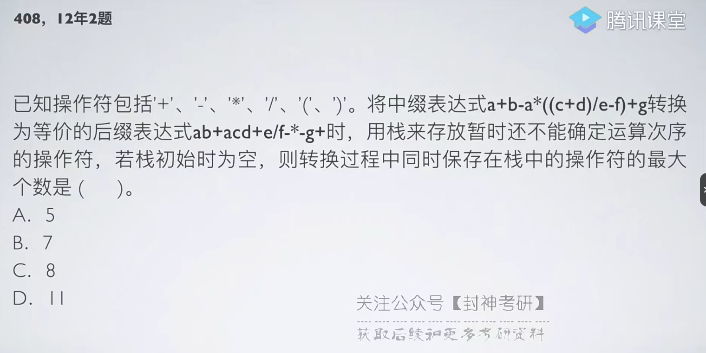
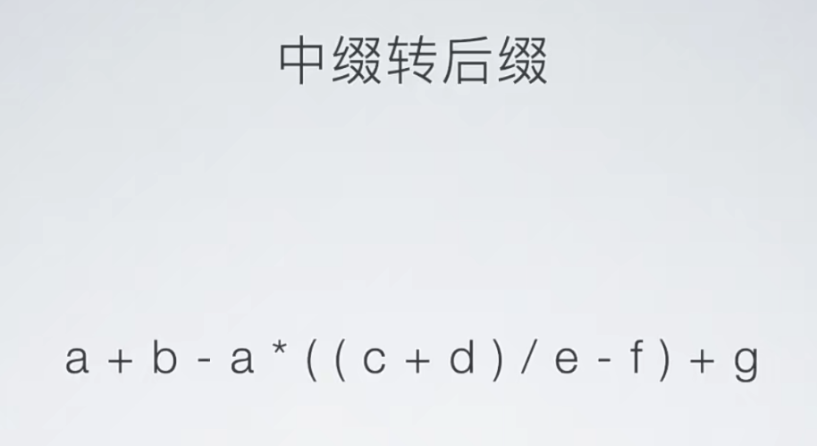
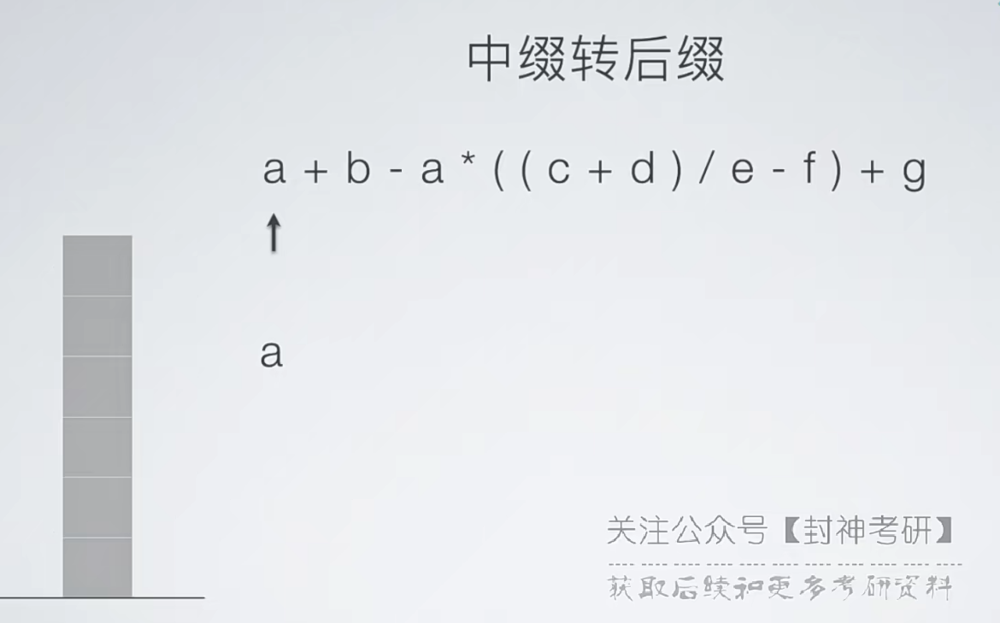
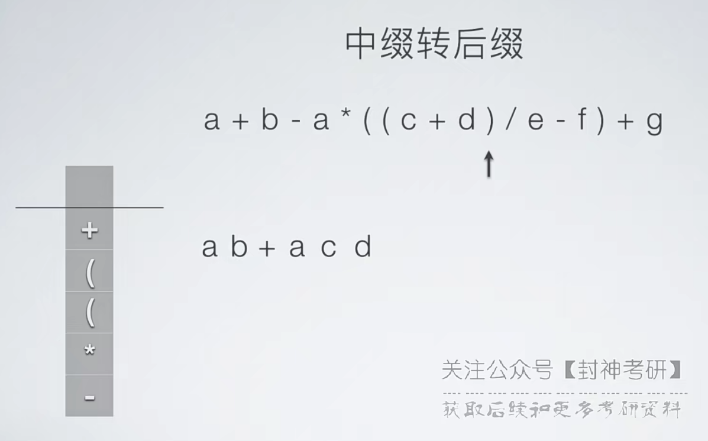
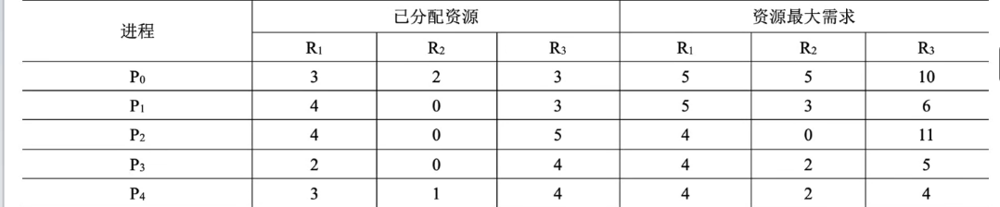
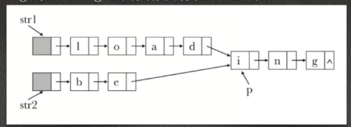

## 2012

### 01.选择题11
```
已知操作数符包括‘+’、‘-’、‘*’、‘/’、‘(’、‘)’。
将中缀表达式a+b-a*((c+d)/e-f)+g转换为等价的后缀表达式ab+acd+e/f-*-g+时，
用栈来存放暂时还不能确定运算次序的操作符，
若栈初始时为空，
则转换过程中同时保存在栈中的操作符的最大个数是（）
A.5
B.7
C.8
D.11
```
> 用“栈”实现中缀转后缀









- 1、从左到右扫描；
- 2、首先扫描到操作数a，将其写入结果表达式；
- 3、然后扫描到“+”，此时栈空，直接入栈；
- 4、然后扫描到b，写入结果表达式；
- 5、再然后扫描到“-”，根据之前的运算规则【***刚扫描出来的运算符的优先级小于等于栈顶运算符时，栈顶运算符出栈，写入结果表达式***】，
  - 此时“-”小于等于栈顶的“+”，
  - 此时“+”出栈，写入结果表达式，
  - 此时栈空，将“-”入栈；
- 6、计算扫描到a，直接写入结果表达式；
- 7、继续扫描到“\*”，“\*”的运算符优先级大于此时栈顶的“-”，因此“\*”入栈；
- 8、接着扫描到两个“(”，二话不说直接入栈；
- 9、然后扫描到c，直接写入结果表达式；
- 10、继续扫描“+”，由于栈顶此时是左括号，所以直接将“+”入栈；
- 11、继续扫描得到d，再次写入结果表达式；
- 12、接着扫描到“)”，此时就需要一直出栈，直到把栈顶到左括号之间的运算符全部出栈，并写入结果表达式，括号直接扔掉；
- 13、继续扫描到“/”，此时栈顶还是“)”，将"/"入栈；
- 14、接着扫描到e，直接写入结果表达式；
- 15、继续扫描到“-”，由于"-"运算符优先级小于此时栈顶的"/"，"/"出栈，并写入结果表达式；
- 16、继续拿着上面扫描出的“-”和栈顶元素进行比较，发现是“)”，所以将“-”入栈；
- 17、继续扫描得到f，将其写入结果表达式；
- 18、继续扫描得到“)”，此时将栈顶到“(”之间的运算符全部出栈，并写入结果表达式，括号扔掉；
- 19、继续扫描得到“+”，“+”运算符优先级小于栈顶的“\*”，此时将“\*”出栈，并写入结果表达式；
- 20、继续拿上面扫描出的”+“和新的栈顶运算符”-“进行比较，”+“与”-“运算符优先级相同，此时”-“出栈，并写入结果表达式；
- 21、此时栈空，“+”入栈；
- 22、继续扫描得到g，则将g写入结果表达式；
- 23、此时，已扫描到表达式的尾部，将栈中的运算符全部出栈，并写入结果表达式；

### 02.选择题81
```
下列关于最小生成树的叙述中，正确的是（）
I. 最小生成树的代价唯一
II. 所有权值最小的边一定会出现在所有的最小生成树中
III. 使用普利姆（Prim）算法从不同顶点开始得到的最小生成树一定相同
IV. 使用普利姆算法和克鲁斯卡尔（Kruskal）算法得到的最小生成树总不相同
A. 仅I
B. 仅II
C. 仅I、III
D. 仅II、IV
```

### 03.选择题101
```
在内部排序过程中，对尚未确定最终位置的所有关键字进行一遍处理称为一趟排序。
下列排序算法中，每一趟排序结束时都至少能够确定一个关键字最终位置的方法是（）
I. 简单选择排序
II. 希尔排序
III. 快速排序
IV. 堆排序
V. 归并排序

A. 仅I、III、IV
B. 仅I、III、V
C. 仅II、III、IV
D. 仅III、IV、V
```

### 04.选择题111
```
对同一待排序列分别进行折半插入排序和直接插入排序，
两者之间可能得不同之处是（）
A. 排序的总趟数
B. 关键字的移动次数
C. 使用辅助空间的数量
D. 关键字之间的比较次数
```

### 05.选择题131
```
假设编译器规定int和short类型长度分别为32位和16位，
若有下列C语言语句：
unsigned short x = 65530;
unsigned int y = x;
得到y的机器数为（）

A. 0000 7FFAH
B. 0000 FFFAH
C. FFFF 7FFAH
D. FFFF FFFAH
```

### 06.选择题231
```
下列选项中，不可能在用户态发生的事件是（）
A. 系统调用
B. 外部中断
C. 进程切换
D. 缺页
```

### 07.选择题241
```
中断处理和子程序调用都需要压栈以保护现场。
中断处理一定会保存而子程序调用不需要保存其内容的是（）。
A. 程序计数器
B. 程序状态字寄存器
C. 通用数据寄存器
D. 通用地址寄存器
```

### 08.选择题251
```
下列关于虚拟存储的叙述中，正确的是（）
A. 虚拟存储只能基于连续分配技术
B. 虚拟存储只能基于非连续分配技术
C. 虚拟存储容量只受外存容量的限制
D. 虚拟存储容量只受内存容量的限制
```

### 09.选择题261
```
操作系统的I/O子系统通常由4个层次组成，
每一层明确定义了与邻近层次的接口，其合理的层次组织排列顺序是（）
A. 用户级I/O软件、设备无关软件、设备驱动程序、中断处理程序
B. 用户级I/O软件、设备无关软件、中断处理程序、设备驱动程序
C. 用户级I/O软件、设备驱动程序、设备无关软件、中断处理程序
D. 用户级I/O软件、中断处理程序、设备无关软件、设备驱动程序
```

### 10.选择题271
```
假设5个进程P0、P1、P2、P3、P4共享3类资源R1、R2、R3，
这些资源总数分别为18、6、22。
T0时刻的资源分配情况见下表，此时存在的一个安全序列是（）。
A. P0，P1，P4，P1，P3
B. P1，P0，P3，P4，P2
C. P2，P1，P0，P3，P4
D. P3，P4，P2，P1，P0
```


### 11.选择题281
```
若一个用户进程通过read系统调用读取一个磁盘文件中的数据，
则下列关于此过程的叙述中，正确的是（）
I. 若该文件的数据不在内存中，则该进程进入睡眠等待状态
II. 请求read系统调用会导致CPU从用户态切换到核心态
III. read系统调用的参数应包含文件的名称
A. 仅I、II
B. 仅I、II
C. 仅II、III
D. I、II和III

当用户进程读取的磁盘文件数据不在内存时，转向中断处理，导致CPU从用户态切换到核心态，此时该进程进入睡眠等待状态（阻塞态）；
在调用read之前，需要用open打开该文件，open的作用就是产生一个文件编号或索引指向打开的文件，
之后的所有操作都利用这个编号或索引号直接进行，不再考虑物理文件名，所以read系统调用的参数不应包含物理文件名。
文件使用结束后要用close关闭文件，消除文件编号或索引。
```

### 12.选择题291
```
一个多道批处理系统中仅有P1和P2两个作业，P2比P1晚5ms到达。
它们的计算和I/O操作顺序如下：
P1：计算60ms，I/O 80ms，计算20ms。
P2：计算120ms，I/O 40ms，计算40ms。
若不考虑调度和切换时间，则完成两个作业需要的时间最少是（）。
A. 240ms
B. 260ms
C. 340ms
D. 360ms
```

### 13.选择题301
```
若某单处理器多进程系统中有多个就绪进程，
则下列关于处理器调度的叙述中，错误的是（）。
A. 在进程结束时能进行处理器调度
B. 创建新进程后能进行处理器调度
C. 在进程处于临界区时不能进行处理器调度
D. 在系统调用完成并返回用户态时能进行处理器调度
```

### 14.选择题311
```
下列关于进程和线程的叙述中，正确的是（）。
A. 不管系统是否支持线程，进程都是资源分配的基本单位
B. 线程是资源分配的基本单位，进程是调度的基本单位
C. 系统级线程和用户级线程的切换都需要内核的支持
D. 同一进程中的各个线程拥有各自不同的地址空间

进程始终是操作系统资源分配的基本单位，线程不能直接被系统分配资源；
用户级线程切换不需要通过内核，因为用户级线程只在用户进程的空间内活动，系统并不能感知到用户级线程的存在。
同一进程下的各线程共享进程的地址空间，并共享进程所持有的资源。
注意：线程有自己的栈空间，不与其他线程共享。
```

### 15.选择题321
```
下列选项中，不能改善磁盘设备I/O性能的是（）。
A. 重排I/O请求次序
B. 在一个磁盘上设置多个分区
C. 预读和滞后写
D. 优化文件物理的分布
```

### 16.选择题331
```
在TCP/IP体系结构中，直接为ICMP提供服务的协议是（）。
A. PPP
B. IP
C. UDP
D. TCP

ICMP：控制报文协议，是用来发出控制信息的，来实现一些网络测试等控制功能，最熟悉的ping命令
ICMP属于网络层协议，ICMP报文直接作为IP数据报的数据，然后再加上IP数据报的首部进行传送，所以IP直接为ICMP提供服务。
```

### 17.选择题341
```
在物理层接口特性中，用于描述完成每种功能的事件发生顺序的是（）。
A. 机械特性
B. 功能特性
C. 过程特性
D. 电气特性

确定传输媒体结构的一些特性：
机械特性：规定接口形状，引线数目；
功能特性：规定高电压表示1，低电压表示0；
电气特性：规定电压范围；
过程特性：规定连接建立好之后，各个相关部件的工作步骤。（规程特性）
```

### 18.综合题411
```
设有6个有序表A、B、C、D、E、F，
分别含有10、35、40、50、60和200个数据元素，
各表中元素按升序排列。
要求通过5次两两合并，
将6个表最终合并成1个升序表，
并在最坏情况下比较的总次数达到最少。请回答下列问题。
（1）给出完整的合并过程，并求出最坏情况下比较的总次数。
（2）根据你的合并过程，描述N（N≥2）个不等长升序表的合并策略，并说明理由。

（1）按构造哈夫曼树的规则合并即可：
总的比较次数为825次

（2）各表的合并策略是：在对多个有序表进行两两合并时，若表长不同，则最坏情况下总的比较次数依赖于表的合并次序。
可以借用哈夫曼树的构造规则，依次选择最短的两个表进行合并，可以获得最坏情况下最佳的合并效率。
```

### 19.综合题421
```
假定采用带头结点的单链表保存单词，当两个单词有相同的后缀时，
则可共享相同的后缀存储空间，例如，“loading”和“being”的存储映像如下图所示。
设str1和str2分别指向两个单词所在单链表的头结点，
链表结点结构为{data,next}，
请设计一个时间上尽可能高效的算法，
找出由str1和str2所指向两个链表共同后缀的起始位置（如图中字符i所在结点的位置p）。
（1）给出算法的基本设计思想。
（2）根据设计思想，采用C或C++或JAVA语言描述算法，关键之处给出注释。
（3）说明你所设计算法的时间复杂度。

1.分别求出str1和str2所指的两个链表的长度m和n。
2.令指针p、q分别指向str1和str2的头结点，若m>=n，则使p指向链表中的第m-n+1个结点；
若m<n，则使q指向链表中的第n-m+1个结点；
即使指针p和q所指的结点到表尾的长度相等。
3.将指针p和q同步向后移动，并判断它们是否指向同一结点。
若p和q指向同一结点，则该点即为所求的共同后缀的起始位置。
```


```
LNode* findFirstCommon(LNode* str1,LNode* str2){
  int len1 = 0,len2 = 0;
  LNode* p = str1->next, q = str2->next;
  while(p != NULL){
    len1++;
    p=p->next;
  }
  while(q != NULL){
    len2++;
    q=q->next;
  }
  for(p=str1->next;len1>len2;len1--){
    p=p->next;
  }
  for(p=str2->next;len1<len2;len2--){
    q=q->next;
  }
  while(p!=NULL && p!=q){
    p=p->next;
    q=q->next;
  }
  return p;
}
```

### 20.综合题431
```
假定某计算机的CPU主频为80MHz，CPI为4，
平均每条指令访存1.5次，主存与Cache之间交换的块大小为16B，
Cache的命中率为99%，存储器总线宽带为32位。请回答下列问题。
（1）该计算机的MIPS数是多少？平均每秒Cache缺失的次数是多少？在不考虑DMA传送的情况下，主存带宽至少达到多少才能满足CPU的访存要求？
（2）假定在Cache缺失的情况下访问主存时，存在0.0005%的缺页率，则CPU平均每秒产生多少次缺页异常？
若页面大小为4KB，每次缺页都需要访问磁盘，访问磁盘时DMA传送采用周期挪用方式，
磁盘I/O接口的数据缓冲寄存器为32位，则磁盘I/O接口平均每秒发出的DMA请求次数至少是多少？
（3）CPU和DMA控制器同时要求使用存储器总线时，哪个优先级更高？为什么？
（4）为了提高性能，主存采用4体低位交叉存储模式，工作时每1/4个存储周期启动一个体。若每个体的存储周期为50ms，则该主存能提供的最大带宽是多少？
```


